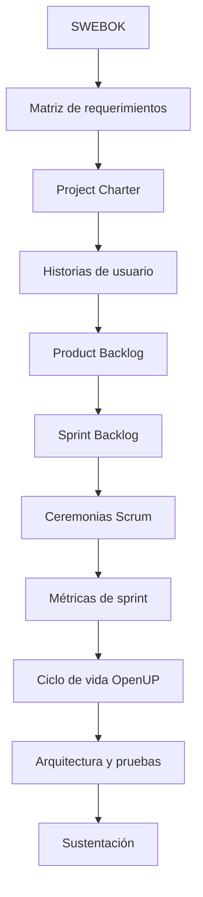

# Guía del Proyecto Sello de Ingeniería de Software I

## 1. Propósito

El Proyecto Sello integra las sesiones de **Ingeniería de Software I** alrededor de un mismo proyecto de software que se inicia, planifica y gestiona de manera progresiva. Cada sesión agrega una capacidad real de ingeniería y gestión de proyectos hasta llegar a un proyecto formulado con SWEBOK como marco conceptual, gestionado con Scrum, comparado y adaptado frente a OpenUP, y sustentado integralmente.

### Competencia o capacidad del proyecto

Al finalizar el Proyecto Sello, el estudiante demuestra que puede iniciar y planificar un proyecto de software aplicando el cuerpo de conocimiento de la Ingeniería de Software (SWEBOK), gestionarlo con los roles, artefactos y ceremonias de Scrum, comparar y adaptar su ejecución frente al ciclo de vida, fases, roles y entregables de OpenUP, y sustentar integralmente el proceso y los incrementos entregados.

### Competencias relacionadas

| Código | Competencia | Relación con el proyecto |
|---|---|---|
| CE021 | Ingeniería de Requerimientos | Evidencia la elicitación y gestión de requerimientos mediante la matriz de requerimientos, el Project Charter y el Product Backlog con historias de usuario. |
| CE024 | Calidad de Software | Evidencia la gestión técnica y aseguramiento de calidad del proceso (CE0243) mediante SWEBOK, control de cambios, ceremonias Scrum y checklists de seguimiento OpenUP. |
| CE023 | Programación | Evidencia los incrementos de software entregados durante los sprints o iteraciones del proyecto. |

Fuente oficial de los códigos: [Transcripción de evidencias por competencia — Ingeniería de Software](https://upeuoficial.github.io/planb/transcripcion/#c-area-de-ingenieria-de-software).

```text
SWEBOK -> Matriz de requerimientos -> Project Charter -> Historias de usuario -> Backlog y sprints Scrum -> Ciclo de vida OpenUP -> Arquitectura y pruebas -> Sustentación
```

## 2. El Proyecto

Durante el semestre iniciarás y gestionarás un **proyecto de software real o simulado**, aplicando SWEBOK como marco conceptual, Scrum como framework de gestión ágil, y OpenUP como marco de comparación y adaptación de ciclo de vida.

El proyecto debe partir de un problema de negocio concreto y avanzar mediante entregables acumulativos: matriz de requerimientos y Project Charter, historias de usuario y backlogs priorizados con evidencias de las ceremonias Scrum, y un documento de arquitectura con casos de prueba ejecutados bajo el ciclo de vida de OpenUP.

El proyecto debe cumplir estas condiciones:

- Partir de un problema de negocio real o simulado, claramente delimitado.
- Formular un Project Charter completo y coherente con las áreas de conocimiento de SWEBOK.
- Gestionarse con los roles, artefactos y ceremonias de Scrum durante toda la Unidad 2.
- Ejecutar y sustentar, en la Unidad 3, la comparación o adaptación frente al ciclo de vida de OpenUP.
- Evidenciar métricas de proceso, control de cambios y cumplimiento de ceremonias.
- Ser sustentado técnicamente por todos los integrantes del equipo.

No se considera Proyecto Sello:

- Un Project Charter sin un proyecto de software real detrás.
- Un Backlog copiado o genérico, sin relación con el problema elegido.
- Ceremonias Scrum simuladas o narradas sin evidencia real de ejecución.
- Un ciclo de vida OpenUP descrito solo en teoría, sin aplicarlo ni compararlo con el proyecto gestionado.
- Incrementos de software inexistentes cuando el alcance del equipo los exige.
- Un proyecto que el equipo no pueda sustentar con evidencias de gestión y de proceso.

## 3. Evolución del Proyecto

| Unidad | Temas principales | Evolución del proyecto |
|---|---|---|
| Unidad 1: Cuerpo de Conocimiento de Ingeniería de Software | SWEBOK: requerimientos, arquitectura y diseño, construcción, pruebas, gestión de la configuración, operaciones y mantenimiento. | Project Charter fundamentado en SWEBOK, con matriz de requerimientos y control de cambios. |
| Unidad 2: Metodología Ágil SCRUM | Fundamentos ágiles, comparación de marcos, roles y ceremonias, artefactos, sprints, retrospectiva y métricas. | Avance del proyecto gestionado con historias de usuario, Product Backlog, Sprint Backlog y evidencias de las ceremonias Scrum. |
| Unidad 3: Metodología Ágil OpenUP | Ciclo de vida, fases y disciplinas, roles y entregables, tareas e iteraciones de OpenUP. | Proyecto integrador sustentado que consolida el Project Charter y los artefactos Scrum, con documento de arquitectura, casos de prueba y comparación o adaptación frente a OpenUP. |



### Alineamiento por sesiones

Este alineamiento muestra cómo el proyecto avanza desde la formulación conceptual con SWEBOK hasta la gestión ágil con Scrum y la comparación o adaptación frente al ciclo de vida de OpenUP.

| Sesiones | Contenido central | Avance del proyecto |
|---|---|---|
| S1 | Introducción al curso, presentación del sílabo, SWEBOK. | Conformación del equipo de trabajo. |
| S2 | SWEBOK: Requerimientos, Arquitectura y Diseño del Software. | Matriz de requerimientos del problema elegido. |
| S3 | SWEBOK: Construcción, Pruebas de Software y Gestión de la Configuración del Software. | Control de cambios y enunciado de trabajo (información base) del proyecto. |
| S4 | SWEBOK: Operaciones y Mantenimiento del Software. | Formulación del Project Charter del proyecto del semestre. |
| S5 | Evaluación U1: examen teórico y exposición del Project Charter. | Producto U1 sustentado: Project Charter con matriz de requerimientos. |
| S6 | Exposición y sustentación del Project Charter considerando roles, artefactos y ceremonias Scrum. | Project Charter corregido y comprensión inicial de Scrum. |
| S7 | Fundamentos ágiles: Agile Manifesto y principios; comparación de marcos ágiles (Scrum, Kanban, XP). | Diseño del proceso de desarrollo del proyecto en base a Scrum. |
| S8 | Scrum: roles y ceremonias. | Historias de usuario del proyecto. |
| S9 | Scrum: artefactos y herramientas. | Product Backlog y Sprint Backlog priorizados. |
| S10 | Scrum: Sprints, Retrospectiva, Métricas. | Análisis de indicadores y métricas del avance del proyecto. |
| S11 | Evaluación U2: examen de caso práctico y exposición del avance del proyecto. | Producto U2 sustentado: avance del proyecto con artefactos y evidencias Scrum. |
| S12 | Ciclo de vida OpenUP. | Diseño del proceso de desarrollo del proyecto en base a OpenUP. |
| S13 | OpenUP: Fases y Disciplinas. | Seguimiento y control con los formatos de gestión de OpenUP. |
| S14 | OpenUP: Roles y Entregables. | Documento de arquitectura del proyecto. |
| S15 | OpenUP: Tareas e Iteraciones. | Ejecución de casos de prueba sobre el software desarrollado. |
| S16 | Evaluación U3 y sustentación del proyecto integrador. | Producto final sustentado: proyecto integrador con evidencias de Scrum y su adaptación a OpenUP. |

## 4. Cronograma

| Hito | Momento | Producto esperado |
|---|---|---|
| S1 | Brief del proyecto | Conformación del equipo y problema de negocio elegido. |
| S5 | Producto U1 | Project Charter con matriz de requerimientos y control de cambios, sustentado. |
| S11 | Producto U2 | Avance del proyecto con historias de usuario, Product Backlog, Sprint Backlog y evidencias de ceremonias Scrum, sustentado. |
| S16 | Producto final | Proyecto integrador con documento de arquitectura, casos de prueba y comparación/adaptación frente a OpenUP, sustentado. |

## 5. Producto Final

### Repositorio académico y topics

Desde la primera presentación del proyecto, el repositorio debe estar creado y configurado con los topics académicos mínimos. Esta configuración es obligatoria porque permite identificar campus, semestre, línea, tipo de proyecto, curso, sección y grupo.

El detalle oficial del estándar se encuentra en [Estándar transversal de topics para repositorios académicos](https://upeuoficial.github.io/planb/anexos/estandar-topics-repositorios/).

Ejemplo base para IS1:

```text
campus-juliaca
semestre-2026-2
linea-software
tipo-ps
is1
seccion-g1
grupo-<numero>-<nombre-proyecto>
```

Componentes mínimos:

- Project Charter completo (objetivos, problema, EDT, equipo de trabajo y riesgos).
- Matriz de requerimientos con criterios de control de cambios y configuración.
- Historias de usuario coherentes con el Project Charter.
- Product Backlog priorizado y Sprint Backlog derivado de él.
- Evidencias del cumplimiento de las ceremonias Scrum (Daily Meeting, Sprint Review, Sprint Retrospective).
- Métricas de sprint (indicadores de avance y retrospectiva).
- Documento de arquitectura elaborado bajo el ciclo de vida de OpenUP.
- Casos de prueba ejecutados sobre el software del proyecto.
- Comparación o adaptación del proyecto frente al ciclo de vida, fases, disciplinas, roles y entregables de OpenUP.
- Evidencias de incrementos de software cuando el alcance del equipo así lo exige.

## 6. Evaluación por competencias

Los criterios se organizan según una matriz común de evaluación de proyectos académicos: problema, requerimientos, diseño, implementación, datos, integración y calidad, validación y sustentación. Cada criterio se adapta al enfoque de iniciación y gestión ágil de proyectos de software, y se verifica mediante evidencias del producto, el repositorio y la demostración.

| Dimensión común | Criterio del PS | Capacidad evaluada | Evidencias esperadas |
|---|---|---|---|
| 1. Problema y alcance | Alcance del proyecto e iniciación | Delimita el problema de negocio y formula el inicio del proyecto aplicando SWEBOK. | Enunciado de trabajo, matriz de requerimientos y Project Charter (objetivos, alcance, EDT, riesgos). |
| 2. Requerimientos o funcionalidad esperada | Requerimientos y backlog | Traduce el problema en requerimientos gestionables y en historias de usuario priorizadas. | Matriz de requerimientos, control de cambios, historias de usuario y Product Backlog priorizado. |
| 3. Diseño, modelo o arquitectura | Diseño del proceso y arquitectura | Diseña el proceso de desarrollo con Scrum y elabora el documento de arquitectura frente a OpenUP. | Diseño del proceso Scrum, comparación con Kanban/XP y documento de arquitectura OpenUP. |
| 4. Implementación técnica | Gestión ágil aplicada | Aplica los roles, ceremonias y artefactos de Scrum, y ejecuta tareas e iteraciones bajo OpenUP. | Sprint Backlog ejecutado, evidencias de ceremonias y formatos de seguimiento OpenUP. |
| 5. Datos, persistencia o procesamiento | Métricas del proceso | Analiza indicadores y métricas del avance del proyecto por sprint. | Métricas de sprint, retrospectiva e indicadores de proceso. |
| 6. Integración del producto y calidad técnica | Integración del proceso y calidad | Integra el Project Charter, los artefactos Scrum y los entregables OpenUP en un solo proyecto coherente y trazable. | Consolidación de entregables por unidad, trazabilidad entre requerimientos, backlog y arquitectura, documentación. |
| 7. Validación, pruebas o resultados | Pruebas y evidencias de cumplimiento | Verifica el cumplimiento de eventos y artefactos Scrum, y ejecuta casos de prueba sobre el software. | Checklist de cumplimiento Scrum, casos de prueba ejecutados y resultados documentados. |
| 8. Sustentación técnica y profesional | Sustentación integral | Defiende técnica y profesionalmente el proyecto, evidenciando autoría, comprensión y responsabilidad académica. | Pitch, demo, defensa técnica, aporte individual, repositorio, topics y MkDocs o equivalente. |

### Rúbrica

| Criterios | % | A (20) | B (15) | C (10) | D (5) |
|---|---:|---|---|---|---|
| 1. Problema y alcance | 10% | Problema claro, viable y bien delimitado; el alcance responde al contexto y está justificado. | Problema y alcance comprensibles, con algunos límites o justificaciones por precisar. | Problema poco delimitado o alcance parcialmente viable. | Problema confuso, sin alcance definido o sin relación clara con el producto. |
| 2. Requerimientos o funcionalidad esperada | 10% | Funcionalidades o requerimientos completos, coherentes y verificables según la necesidad planteada. | Funcionalidades principales cubiertas, con detalles menores pendientes o poco precisos. | Funcionalidades incompletas o parcialmente alineadas al problema. | Funcionalidades ausentes, inconexas o sin relación verificable con la necesidad. |
| 3. Diseño, modelo o arquitectura | 10% | Diseño, modelo o arquitectura coherente, aplicado y alineado al producto; muestra estructura y decisiones claras. | Diseño funcional con limitaciones menores o decisiones parcialmente justificadas. | Diseño poco claro, incompleto o aplicado de forma parcial. | No presenta diseño, modelo o arquitectura verificable. |
| 4. Implementación técnica | 10% | Implementación correcta, funcional y alineada a los contenidos centrales del curso. | Implementación funcional con detalles técnicos menores por corregir. | Implementación parcial, con errores o uso limitado de los contenidos del curso. | Implementación insuficiente, no funcional o no relacionada con los contenidos del curso. |
| 5. Datos, persistencia o procesamiento | 10% | Los datos se gestionan, almacenan, consultan o procesan correctamente según el tipo de proyecto. | Gestión de datos funcional con detalles menores de consistencia, estructura o procesamiento. | Gestión de datos parcial, limitada o con errores relevantes. | No hay manejo de datos verificable o este impide el funcionamiento del producto. |
| 6. Integración del producto y calidad técnica | 10% | El producto funciona como sistema integrado, ordenado, documentado y reproducible. | Integración funcional con detalles menores de organización, documentación o reproducibilidad. | Integración parcial; existen componentes aislados, desorden o evidencias incompletas. | Componentes desconectados, sin organización técnica ni evidencia reproducible. |
| 7. Validación, pruebas o resultados | 10% | Presenta pruebas, evidencias o resultados claros que comprueban el funcionamiento y el valor del producto. | Presenta evidencias suficientes, con algunos casos o resultados por completar. | Evidencias limitadas, poco claras o con validación parcial. | No presenta pruebas, evidencias ni resultados verificables. |
| 8. Sustentación técnica y profesional | 30% | Explica y defiende el producto con solvencia; demuestra aporte individual, dominio técnico, comunicación clara, repositorio, documentación y actitud profesional. | Sustentación clara y funcional, con detalles menores en defensa técnica, evidencias, comunicación o documentación. | Sustentación parcial; dominio, evidencias, comunicación o aporte individual insuficientemente demostrados. | No sustenta adecuadamente, no demuestra autoría o no presenta evidencias mínimas del producto. |

### Subaspectos de la sustentación integral

La sustentación integral debe representar como mínimo el 30% de la evaluación del proyecto. Se revisa mediante los siguientes subaspectos:

| Subaspecto | Qué observa |
|---|---|
| 1. Defensa técnica | Explicación del Project Charter, el proceso Scrum, la comparación/adaptación con OpenUP, las decisiones de gestión, limitaciones y evidencias generadas. |
| 2. Comunicación y orden | Claridad, estructura, tiempo y lenguaje técnico. |
| 3. Presentación personal y actitud | Puntualidad, vestimenta limpia y adecuada, higiene, cabello ordenado, actitud profesional, respeto, honestidad y coherencia con los valores y principios cristianos de la institución. |
| 4. Aporte individual | Cada integrante demuestra lo que hizo. |
| 5. Repositorio y estándares | Topics, organización, commits, documentación y reproducibilidad. |
| 6. MkDocs o equivalente | Documentación publicada, navegable y alineada al producto. |
| 7. Pitch/demo ejecutiva | Introducción clara del problema, solución y valor, seguida de una demo funcional. |

La sustentación profesional forma parte de la evaluación porque el producto final no solo debe funcionar; también debe ser presentado, explicado y defendido con responsabilidad académica, ética, respeto, honestidad y coherencia con los valores y principios cristianos de la institución.

## 7. Sustentación

La sustentación inicia con un video pitch breve o introducción ejecutiva de 1 a 3 minutos para presentar el problema, la solución, el valor del proyecto y la participación del equipo o estudiante.

| Momento | Tiempo sugerido | Propósito |
|---|---:|---|
| Exposición técnica | 10 minutos | Presentar el Project Charter, el backlog, las ceremonias Scrum, la arquitectura y la comparación con OpenUP. |
| Demostración en vivo | 5 minutos | Mostrar el backlog priorizado, las evidencias de sprint y los incrementos o resultados del proyecto. |

Cada integrante debe demostrar su aporte: requerimientos, gestión Scrum, arquitectura y adaptación OpenUP, pruebas o documentación. La defensa es grupal, pero la nota técnica exige aporte individual verificable.

## 8. Resultado Esperado

Al finalizar el curso, el estudiante debe demostrar que puede iniciar, gestionar y sustentar un proyecto de software aplicando SWEBOK, Scrum y OpenUP de forma articulada.

```text
SWEBOK -> Project Charter -> Backlog y sprints Scrum -> Incrementos -> Ciclo de vida OpenUP -> Arquitectura y pruebas -> Sustentación
```

## Anexo. Secuencia sugerida de presentación

La presentación puede organizarse con una secuencia breve de apoyo visual. El video pitch o introducción ejecutiva abre la sustentación y no reemplaza la demo ni la defensa técnica.

| Orden | Slide o momento | Propósito | Competencia evidenciada |
|---:|---|---|---|
| 1 | Título del proyecto y equipo | Identificar el proyecto, los integrantes y el problema elegido. | CE021 |
| 2 | Video pitch o introducción ejecutiva | Presentar el problema, el proyecto y la participación del equipo. | CE021 |
| 3 | 1. Problema y alcance | Explicar el problema de negocio y el Project Charter. | CE021 |
| 4 | SWEBOK aplicado | Mostrar la matriz de requerimientos, el control de cambios y las áreas de conocimiento aplicadas. | CE021 |
| 5 | Gestión Scrum | Presentar las historias de usuario, el Product Backlog y el Sprint Backlog. | CE024 |
| 6 | Ceremonias y métricas | Evidenciar el Daily Meeting, la Sprint Review, la Retrospectiva y las métricas de sprint. | CE024 |
| 7 | Ciclo de vida OpenUP | Explicar las fases, disciplinas, roles y entregables aplicados o adaptados. | CE021 + CE024 |
| 8 | Arquitectura y pruebas | Mostrar el documento de arquitectura y los casos de prueba ejecutados. | CE023 + CE024 |
| 9 | Incrementos del proyecto | Presentar evidencias del avance o del software construido durante los sprints. | CE023 |
| 10 | 4. Aporte individual | Indicar qué hizo cada integrante. | CE024 |
| 11 | 5. Repositorio y estándares | Mostrar repositorio, topics, estructura, documentación publicada en MkDocs o equivalente, y evidencias de gestión. | CE024 |
| 12 | Limitaciones y mejoras | Reconocer límites del proyecto y mejoras posibles. | CE024 |

## Anexo. Plantilla mínima de documentación MkDocs o equivalente

La documentación publicada no reemplaza al informe. Su función es permitir que otra persona comprenda, ejecute, revise y verifique el producto desde el repositorio.

| Página o sección | Contenido mínimo | Evidencia esperada |
|---|---|---|
| Inicio | Nombre del proyecto, problema, solución, curso o cursos, integrantes y enlace al repositorio. | Presentación clara del producto. |
| Instalación o ejecución | Requisitos, dependencias, configuración y comandos para ejecutar el proyecto. | Instrucciones reproducibles. |
| Uso del sistema | Flujo principal, pantallas, comandos, endpoints, notebooks o casos de uso según corresponda. | Guía breve para probar el producto. |
| Arquitectura o estructura | Diagrama, componentes, carpetas principales y decisiones técnicas. | Vista técnica comprensible. |
| Módulos o funcionalidades | Descripción de las funciones principales del producto. | Relación entre funcionalidades y problema. |
| Datos | Modelo, archivos, base de datos, datasets, fuentes o estructura de almacenamiento según el curso. | Evidencia de gestión de datos. |
| Pruebas y evidencias | Casos de prueba, capturas, resultados, métricas, validaciones o salidas generadas. | Verificación del funcionamiento. |
| Equipo y aporte individual | Integrantes, responsabilidades, aportes y evidencias de participación. | Autoría verificable. |
| 5. Repositorio y estándares | Topics académicos, estructura, commits, ramas si aplica y criterios de reproducibilidad. | Cumplimiento de estándares técnicos. |
| Limitaciones y mejoras | Restricciones del producto y mejoras futuras priorizadas. | Cierre reflexivo y realista. |

La documentación debe estar disponible desde las primeras presentaciones y crecer con el proyecto. Para FP puede ser una documentación sencilla; para proyectos integradores y cursos avanzados debe ser más completa y técnica.

## Anexo. Plantilla sugerida de informe del proyecto

El informe debe documentar el proyecto de manera breve, verificable y alineada a las competencias evaluadas. No reemplaza la demo ni la sustentación; organiza las evidencias del proyecto.

| Sección | Contenido mínimo | Evidencia esperada |
|---|---|---|
| Portada | Nombre del proyecto, curso, sección, integrantes, docente y semestre. | Datos completos del equipo. |
| Resumen del proyecto | Problema, proyecto gestionado y valor del enfoque SWEBOK, Scrum y OpenUP. | Síntesis de 8 a 12 líneas. |
| Competencia y alcance | Competencia/capacidad del proyecto y competencias relacionadas. | CE021, CE024 y CE023 vinculadas al producto. |
| SWEBOK y Project Charter | Áreas de conocimiento aplicadas, matriz de requerimientos y Project Charter. | Documento de Project Charter y matriz de requerimientos. |
| Gestión Scrum | Historias de usuario, Product Backlog, Sprint Backlog y ceremonias. | Backlogs, evidencias de ceremonias y métricas de sprint. |
| Ciclo de vida OpenUP | Fases, disciplinas, roles y entregables aplicados o adaptados. | Formatos de seguimiento y documento de arquitectura. |
| Incrementos y pruebas | Software construido y casos de prueba ejecutados durante los sprints o iteraciones. | Evidencias de incrementos y resultados de pruebas. |
| Validación y resultados | Cumplimiento de eventos, artefactos y checklist de OpenUP. | Tabla de cumplimiento y evidencias. |
| Repositorio y documentación | Repositorio, topics, estructura y documentación publicada. | URL del repositorio y MkDocs o equivalente. |
| 4. Aporte individual | Responsabilidad de cada integrante. | Tabla de tareas, commits o evidencias por integrante. |
| Limitaciones y mejoras | Límites actuales y mejoras posibles. | Lista priorizada y realista. |
