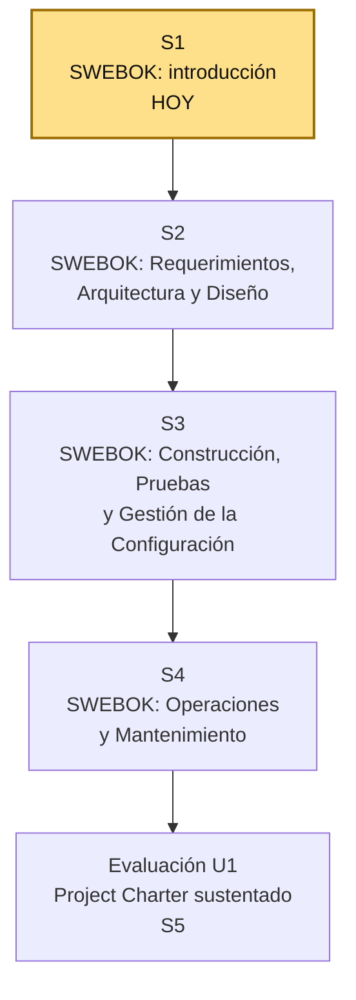

# S1 - Introducción al Curso, Presentación del Sílabo y SWEBOK

## 1. Introducción

Tiempo: 20 min.

### 1.1 Contexto

Un proyecto de software no debería empezar por el código. Antes de escribir la primera línea, un equipo de ingeniería necesita un lenguaje común para hablar de requerimientos, arquitectura, construcción, pruebas y mantenimiento — sin ese lenguaje, cada integrante entiende "calidad" o "diseño" de forma distinta y el proyecto se fragmenta. Esta sesión presenta el sílabo de Ingeniería de Software I y construye ese lenguaje común: el SWEBOK (Software Engineering Body of Knowledge), el marco conceptual que fundamentará el Project Charter del proyecto del semestre.

### 1.2 Índice

1. Qué es el SWEBOK y por qué existe.
2. Las 18 áreas de conocimiento de SWEBOK v4.
3. Áreas de conocimiento que trabaja la Unidad 1.
4. Del SWEBOK al Project Charter.

### 1.3 Propósito de aprendizaje

Al concluir la clase, estarás en condiciones de:

- **Identificar y explicar** las áreas de conocimiento del SWEBOK, y **argumentar** por qué el curso las usa como marco conceptual para iniciar un proyecto de software mediante un Project Charter.

### 1.4 Producto de sesión

Mapa de áreas de conocimiento SWEBOK priorizadas para el proyecto del equipo, con el problema de negocio inicial identificado y el equipo de trabajo conformado.

### 1.5 Metodología

| Fase | Actividades | Orientaciones | Material |
|---|---|---|---|
| Revisión previa individual | Leer el sílabo del curso y el resumen del SWEBOK (ver 1.6). | Trabajo individual, antes de clase; traer al menos una idea de problema de negocio para el proyecto del semestre. | Sílabo IS1 U1. |
| Clase presencial | Presentación del sílabo, lectura guiada del SWEBOK y discusión de sus áreas de conocimiento. | Trabajo en equipo, siguiendo al docente paso a paso; consulta inmediata ante dudas sobre el alcance de cada área. | Pasos 3.1 a 3.7 de esta guía. |
| Evaluación formativa | Revisión en clase de la propuesta inicial del equipo (problema, áreas SWEBOK priorizadas, roles). | La evidencia se completa y sustenta de forma individual, fuera del aula, según los criterios mínimos de la sección 4.2. | Plantilla de evidencia individual (4.1), rúbrica de evaluación (5.4). |

### 1.6 Motivación de la sesión

#### 1.6.1 Caso: el equipo que empieza codificando sin marco de conocimiento

Un equipo de estudiantes recibe el encargo de construir un "Sistema de Reserva de Citas Médicas" para una clínica pequeña. Como ya saben programar, abren el editor de código el primer día: alguien define las tablas de la base de datos a su criterio, otro empieza una pantalla de login, un tercero prueba un framework nuevo porque "se ve bien en YouTube". Tres semanas después nadie sabe qué requerimientos están cubiertos, no existe un diseño acordado, no hay criterio de qué probar, y cada cambio de alcance genera una discusión distinta desde cero.

Pregunta guía:

```text
¿Qué le faltó a este equipo antes de escribir la primera línea de código?
```

Preguntas para los estudiantes:

1. ¿Qué decisiones tomó el equipo sin un marco de referencia común?
2. ¿Qué problemas concretos les habría evitado acordar antes qué es un "requerimiento", un "diseño" o una "prueba" dentro del proyecto?
3. ¿Qué documento inicial habría ordenado el arranque de este proyecto?

### 1.7 Ubicación en el curso

- Unidad: U1 - Cuerpo de Conocimiento de Ingeniería de Software.
- Producto de unidad: Project Charter del proyecto de software fundamentado en las áreas de conocimiento de SWEBOK (matriz de requerimientos, criterios de control de cambios y configuración, enunciado de trabajo, objetivos, EDT, equipo de trabajo y riesgos).
- Producto del curso: Proyecto Sello: proyecto de software formulado con SWEBOK como marco conceptual, gestionado con los roles, artefactos y ceremonias de Scrum, comparado y adaptado frente al ciclo de vida de OpenUP, y sustentado integralmente.
- Avance del producto en esta sesión: equipo de trabajo conformado, problema de negocio identificado y primer mapa de áreas SWEBOK priorizadas para el proyecto.

Roadmap del producto de unidad:



Hoy se reconoce el marco completo de SWEBOK y se elige el problema de negocio del proyecto. En las siguientes sesiones se profundiza en las áreas de conocimiento que fundamentan cada componente del Project Charter: requerimientos, arquitectura y diseño (S2); construcción, pruebas y gestión de la configuración (S3); operaciones y mantenimiento (S4). La evaluación de la Unidad 1 valida el Project Charter completo, sustentado por el equipo.

## 2. Explica

Tiempo: 25 min.

### 2.1 Qué es el SWEBOK y por qué existe

El **SWEBOK** (*Guide to the Software Engineering Body of Knowledge*) es el cuerpo de conocimiento de la Ingeniería de Software publicado por el **IEEE Computer Society**. No es un estándar de cumplimiento obligatorio ni un método de trabajo: es una guía de referencia que identifica y organiza el conocimiento generalmente aceptado de la disciplina, de forma que cualquier equipo pueda hablar el mismo lenguaje técnico sin importar la metodología, el lenguaje de programación o el dominio del proyecto.

El curso usa la edición vigente, **SWEBOK v4.0** (Washizaki, 2024), que amplía la edición anterior (v3, 15 áreas) a **18 áreas de conocimiento (Knowledge Areas, KA)**, incorporando tres áreas nuevas — Arquitectura de Software, Operaciones de Ingeniería de Software y Seguridad de Software — y actualizando el resto para reflejar prácticas ágiles y DevOps.

**Error frecuente**: confundir el SWEBOK con una metodología (como Scrum) o con un estándar de proceso (como la NTP ISO/IEC 12207). El SWEBOK responde a una pregunta distinta: no "cómo se gestiona el proyecto", sino "qué debe saber un ingeniero de software para hacer bien su trabajo, sin importar cómo se organice el equipo".

### 2.2 Las 18 áreas de conocimiento de SWEBOK v4

| # | Área de conocimiento | Qué cubre |
|---|---|---|
| 1 | Software Requirements (Requerimientos de Software) | Elicitación, análisis, especificación y validación de requerimientos. |
| 2 | Software Architecture (Arquitectura de Software) | Estructura de alto nivel del sistema, componentes y decisiones arquitectónicas. |
| 3 | Software Design (Diseño de Software) | Diseño detallado de componentes, módulos e interfaces. |
| 4 | Software Construction (Construcción de Software) | Codificación, pruebas unitarias, integración y gestión de la complejidad al construir. |
| 5 | Software Testing (Pruebas de Software) | Diseño y ejecución de pruebas para verificar el software. |
| 6 | Software Engineering Operations (Operaciones de Ingeniería de Software) | Puesta en producción, monitoreo y operación continua del software. |
| 7 | Software Maintenance (Mantenimiento de Software) | Modificación del software ya en producción: correcciones, mejoras y adaptaciones. |
| 8 | Software Configuration Management (Gestión de la Configuración del Software) | Control de versiones, líneas base y control de cambios sobre los artefactos del proyecto. |
| 9 | Software Engineering Management (Gestión de la Ingeniería de Software) | Planificación, seguimiento y control del trabajo de ingeniería. |
| 10 | Software Engineering Process (Proceso de Ingeniería de Software) | Definición, medición y mejora de los procesos del ciclo de vida del software. |
| 11 | Software Engineering Models and Methods (Modelos y Métodos de Ingeniería de Software) | Modelado del sistema y métodos de desarrollo (estructurados, orientados a objetos, ágiles). |
| 12 | Software Quality (Calidad de Software) | Aseguramiento y control de calidad del proceso y del producto. |
| 13 | Software Security (Seguridad de Software) | Prácticas de ingeniería para construir software seguro desde el diseño. |
| 14 | Software Engineering Professional Practice (Práctica Profesional) | Ética, responsabilidad profesional y trabajo en equipo del ingeniero de software. |
| 15 | Software Engineering Economics (Economía de la Ingeniería de Software) | Análisis costo-beneficio y toma de decisiones económicas del proyecto. |
| 16 | Computing Foundations (Fundamentos de Computación) | Algoritmos, estructuras de datos y fundamentos de programación. |
| 17 | Mathematical Foundations (Fundamentos Matemáticos) | Lógica, teoría de conjuntos y matemática aplicada a la ingeniería de software. |
| 18 | Engineering Foundations (Fundamentos de Ingeniería) | Principios generales de ingeniería aplicados al desarrollo de software. |

**Error frecuente**: tratar las 18 áreas como una lista para memorizar. El SWEBOK se usa como referencia de consulta: un equipo prioriza las áreas relevantes para su proyecto, no las cubre todas con el mismo nivel de profundidad.

### 2.3 Áreas de conocimiento que trabaja la Unidad 1

El resultado de aprendizaje de la asignatura fundamenta el Project Charter en un subconjunto de las 18 áreas, desarrollado a lo largo de las cuatro sesiones de contenido de esta unidad:

| Sesión | Áreas SWEBOK trabajadas | Aporte al Project Charter |
|---|---|---|
| S1 (hoy) | Visión general de las 18 áreas. | Identificación del problema de negocio y priorización inicial de áreas. |
| S2 | Software Requirements; Software Architecture; Software Design. | Matriz de requerimientos y primeras decisiones de arquitectura y diseño. |
| S3 | Software Construction; Software Testing; Software Configuration Management. | Enunciado de trabajo y criterios de control de cambios. |
| S4 | Software Engineering Operations; Software Maintenance. | Formulación completa del Project Charter (objetivos, EDT, equipo, riesgos). |

### 2.4 Del SWEBOK al Project Charter

Cada área de conocimiento no es un tema aislado: alimenta directamente un componente del Project Charter que se construye en esta unidad.

| Componente del Project Charter | Área(s) SWEBOK que lo fundamenta |
|---|---|
| Matriz de requerimientos | Software Requirements |
| Criterios de control de cambios y configuración | Software Configuration Management |
| Enunciado de trabajo (información base) | Software Engineering Process; Software Engineering Management |
| Objetivos y descripción del problema | Software Requirements; Software Engineering Economics |
| EDT (Estructura de Descomposición del Trabajo) | Software Engineering Management |
| Equipo de trabajo | Software Engineering Professional Practice |
| Riesgos | Software Engineering Management; Software Quality |

Un Project Charter que no puede trazarse a ninguna área SWEBOK es una lista de buenas intenciones, no un documento de ingeniería: por eso el curso exige que cada componente del Project Charter cite explícitamente el área de conocimiento que lo sustenta.

## 3. Aplica: actividad práctica guiada

Tiempo: 2h.

Hoja de ruta de la sesión práctica:

- 3.1 Reconocer las 18 áreas de conocimiento de SWEBOK v4.
- 3.2 Leer el extracto guiado del SWEBOK sobre las áreas de la Unidad 1.
- 3.3 Analizar el caso guiado y discutir en equipo.
- 3.4 Identificar el problema de negocio del proyecto del semestre.
- 3.5 Priorizar áreas de conocimiento SWEBOK aplicables al proyecto.
- 3.6 Conformar el equipo de trabajo y roles iniciales.
- 3.7 Completar la plantilla de propuesta inicial.

### 3.1 Reconocer las 18 áreas de conocimiento de SWEBOK v4

**Producto del paso:** lista de las 18 áreas con una frase propia por área.

Usando la tabla de 2.2 como referencia, cada estudiante escribe con sus propias palabras qué cubre cada una de las 18 áreas, sin copiar literalmente la definición.

### 3.2 Leer el extracto guiado del SWEBOK sobre las áreas de la Unidad 1

**Producto del paso:** notas de lectura de las siete áreas de la Unidad 1.

El docente guía la lectura de las áreas que fundamentan el Project Charter (Requirements, Architecture, Design, Construction, Testing, Configuration Management, Operations, Maintenance). Cada estudiante registra, por área, una idea clave y una duda.

### 3.3 Analizar el caso guiado y discutir en equipo

**Producto del paso:** lista de decisiones que el equipo del caso tomó sin marco de referencia.

Retoma el caso de 1.6.1 (Sistema de Reserva de Citas Médicas). En equipo, identifica al menos cuatro decisiones que el equipo del caso tomó sin acordar antes qué área de conocimiento las debía guiar (por ejemplo: "definir tablas sin matriz de requerimientos" corresponde a Software Requirements).

### 3.4 Identificar el problema de negocio del proyecto del semestre

**Producto del paso:** enunciado breve del problema de negocio elegido por el equipo.

Cada equipo elige (o confirma) el problema de negocio real o simulado que desarrollará durante todo el semestre. Responde:

1. ¿Qué problema resuelve el proyecto?
2. ¿Quién lo vive actualmente (usuario o área afectada)?
3. ¿Por qué es un problema relevante para trabajar 16 semanas?

### 3.5 Priorizar áreas de conocimiento SWEBOK aplicables al proyecto

**Producto del paso:** tabla de áreas SWEBOK priorizadas para el proyecto del equipo.

| Área SWEBOK | ¿Aplica al proyecto? | Por qué |
|---|---|---|
| Software Requirements | | |
| Software Architecture | | |
| Software Design | | |
| Software Construction | | |
| Software Testing | | |
| Software Configuration Management | | |

Completa la tabla con el criterio del equipo; no todas las áreas tienen el mismo peso en todos los proyectos.

### 3.6 Conformar el equipo de trabajo y roles iniciales

**Producto del paso:** ficha del equipo con roles iniciales.

Completa:

```text
Nombre del equipo:
Integrantes:
Problema de negocio elegido:
Rol inicial de cada integrante (referente de requerimientos, de arquitectura, de calidad, etc.):
```

### 3.7 Completar la plantilla de propuesta inicial

**Producto del paso:** propuesta inicial completa del proyecto.

Completa:

```text
Problema de negocio:
Usuario o área afectada:
Áreas SWEBOK priorizadas:
Equipo y roles:
Primer riesgo identificado:
```

## 4. Crea: actividad autónoma

Tiempo: 2h fuera del aula.

### 4.1 Plantilla de evidencia individual

Entrega un PDF con el siguiente nombre:

```text
S01_Equipo##_ApellidoNombre.pdf
```

El PDF debe usar esta estructura. La primera sección define el trabajo autónomo; completa las demás con tus evidencias.

#### 4.1.1 Datos del estudiante

- Nombre:
- Equipo:
- Sesión: S01 - Introducción al Curso, Presentación del Sílabo y SWEBOK
- Rol o aporte realizado:
- Link del repositorio:

#### 4.1.2 Trabajo autónomo realizado

Completa y evidencia estas tareas:

1. Confirmar el problema de negocio del proyecto del semestre.
2. Redactar en tus propias palabras las 18 áreas de conocimiento de SWEBOK v4.
3. Priorizar las áreas SWEBOK aplicables a tu proyecto, con justificación.
4. Registrar el equipo de trabajo y los roles iniciales.

#### 4.1.3 Evidencia técnica

Incluye capturas o extractos con una breve explicación debajo de cada uno:

- Lista de las 18 áreas SWEBOK con descripción propia (equivalente a 3.1).
- Tabla de áreas priorizadas para el proyecto, con justificación (equivalente a 3.5).
- Ficha del equipo con roles iniciales (equivalente a 3.6).
- Plantilla de propuesta inicial completa (equivalente a 3.7).

#### 4.1.4 Error o hallazgo

Describe al menos un riesgo o duda que identificaste al elegir el problema de negocio o priorizar las áreas SWEBOK:

- Qué ocurrió o qué limitación encontraste.
- Cómo lo identificaste.
- Cómo lo documentaste o qué supuesto tomaste.

#### 4.1.5 Reflexión técnica breve

Responde en 5 a 8 líneas:

```text
¿Por qué un proyecto de software debe fundamentarse en un cuerpo de conocimiento como SWEBOK antes de empezar a construir?
```

### 4.2 Criterios mínimos de aceptación

La evidencia individual se considera completa si:

- El problema de negocio está delimitado y es coherente con el alcance de un proyecto de 16 semanas.
- Las 18 áreas de SWEBOK están descritas con palabras propias, sin copia literal.
- Las áreas priorizadas para el proyecto están justificadas con al menos una razón concreta cada una.
- El equipo de trabajo y los roles iniciales están registrados.
- La evidencia identifica un aporte individual verificable.

## 5. Cierre evaluativo

Tiempo: 20 min.

Esta sección conecta el resultado de aprendizaje de la sesión con el producto que debe evidenciar cada estudiante.

### 5.1 Resultados esperados

Al finalizar la sesión, el estudiante debe demostrar que:

- Explica qué es el SWEBOK y por qué el curso lo usa como marco conceptual.
- Identifica las 18 áreas de conocimiento de SWEBOK v4.
- Reconoce las áreas SWEBOK que fundamentan el Project Charter de la Unidad 1.
- Delimita el problema de negocio del proyecto del semestre.
- Conforma un equipo de trabajo con roles iniciales.

### 5.2 Evidencia del producto de sesión

Cada estudiante entrega un PDF individual siguiendo la plantilla de la sección 4.1.

Nombre del archivo:

```text
S01_Equipo##_ApellidoNombre.pdf
```

La evidencia debe demostrar:

- Problema de negocio delimitado.
- Áreas SWEBOK priorizadas y justificadas.
- Equipo de trabajo conformado.
- Reflexión técnica breve.

La revisión se realiza con los criterios mínimos de aceptación de la sección 4.2 y la rúbrica de la sección 5.4.

### 5.3 Preguntas de defensa y reflexión

1. ¿Qué diferencia hay entre el SWEBOK y una metodología como Scrum u OpenUP?
2. ¿Qué área SWEBOK consideras más crítica para tu proyecto y por qué?
3. ¿Qué pasaría con tu proyecto si el equipo ignorara la Gestión de la Configuración del Software?
4. ¿Cómo se conecta el área de Requerimientos con el Project Charter que construirás en las próximas sesiones?

### 5.4 Rúbrica de evaluación

| Dimensión | Peso | 3 - Logro destacado | 2 - Logro | 1 - Proceso | 0 - Inicio | Puntuación obtenida |
|---|---:|---|---|---|---|---:|
| 1. Comprensión del SWEBOK | 2 | Explica con precisión qué es el SWEBOK y su propósito como cuerpo de conocimiento. | Explica correctamente qué es el SWEBOK. | Explicación parcial o imprecisa. | No explica qué es el SWEBOK. | |
| 2. Áreas de conocimiento | 2 | Describe las 18 áreas con palabras propias y ejemplos claros. | Describe correctamente las 18 áreas. | Descripción incompleta o copiada. | No identifica las áreas de conocimiento. | |
| 3. Problema de negocio | 2 | Problema delimitado, viable y bien justificado para 16 semanas de trabajo. | Problema delimitado y comprensible. | Problema impreciso o poco delimitado. | No delimita un problema de negocio. | |
| 4. Priorización de áreas SWEBOK | 2 | Prioriza áreas con justificación sólida y conectada al proyecto. | Prioriza áreas de forma correcta. | Priorización débil o sin justificar. | No prioriza áreas para el proyecto. | |
| 5. Aporte individual | 1 | Aporte verificable y bien documentado. | Aporte identificable. | Aporte mencionado de forma general. | Sin aporte individual. | |
| 6. Orden y reflexión | 1 | Evidencia clara, ordenada y reflexión técnica precisa. | Evidencia comprensible. | Evidencia desordenada o superficial. | Sin evidencia suficiente. | |

Puntuación acumulada = suma de (`Peso` * `Puntuación obtenida`) = ____.

Nota final = (`Puntuación acumulada` / 30) * 20 = ____.

Para usar la rúbrica con IA, solicita:

```text
Evalúa el PDF usando la rúbrica de la sesión.
Para cada dimensión selecciona la puntuación obtenida usando la escala Inicio=0, Proceso=1, Logro=2, Logro destacado=3.
Justifica brevemente cada puntuación.
Calcula la puntuación acumulada con la fórmula: suma de (Peso * Puntuación obtenida).
Calcula la nota final sobre 20 con la fórmula: (Puntuación acumulada / 30) * 20.
Indica 2 fortalezas y 2 recomendaciones.
```
