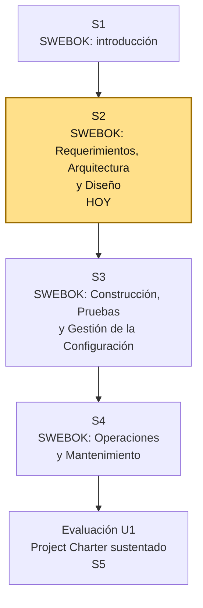

# S2 - SWEBOK: Requerimientos, Arquitectura y Diseño del Software

## 1. Introducción

Tiempo: 20 min.

### 1.1 Presentación de la sesión

Un Project Charter sin matriz de requerimientos es una intención sin fundamento. Esta sesión convierte el problema de negocio elegido en S1 en requerimientos verificables, y en las primeras decisiones de arquitectura y diseño que los sostienen — las tres áreas SWEBOK que hoy alimentan directamente el Project Charter del equipo.

Los 50 min adicionales de esta sección se usan para revisar el trabajo autónomo de S1: el problema de negocio confirmado, las 18 áreas SWEBOK descritas con palabras propias, y las áreas priorizadas para el proyecto de cada equipo.

### 1.2 Índice

1. Software Requirements: de la necesidad al requerimiento verificable.
2. Software Architecture: primeras decisiones estructurales.
3. Software Design: del componente a la interfaz.
4. De la matriz de requerimientos al Project Charter.

### 1.3 Propósito de aprendizaje

Al concluir la clase, estarás en condiciones de:

- **Elaborar y verificar** una matriz de requerimientos funcionales y no funcionales a partir del problema de negocio del equipo, y **proponer** las primeras decisiones de arquitectura y diseño que los sostienen, aplicando las áreas SWEBOK de Software Requirements, Software Architecture y Software Design.

### 1.4 Producto de sesión

Matriz de requerimientos funcionales y no funcionales verificables, con primeras decisiones de arquitectura (estilo, componentes principales) y diseño (módulos, interfaces) del proyecto del equipo.

### 1.5 Metodología

**Tabla 1. Metodología de la sesión**

| Actividades a Realizar en el Periodo | Orientaciones generales (Orientaciones Metodológicas) | Material de estudio recomendado |
|---|---|---|
| Revisión previa individual | Revisar el problema de negocio y las áreas SWEBOK priorizadas en S1. Trabajo individual, antes de clase; traer el enunciado del problema listo para convertir en requerimientos. | Evidencia individual de S1. |
| Clase presencial | Explicación guiada de Software Requirements, Software Architecture y Software Design, y construcción guiada de la matriz de requerimientos y las primeras decisiones estructurales. Trabajo en equipo, siguiendo al docente paso a paso; consulta inmediata ante dudas sobre criterios de verificación. | Pasos 3.1 a 3.7 de esta guía. |
| Evaluación formativa | Revisión en clase de la matriz de requerimientos y de las primeras decisiones de arquitectura y diseño de cada equipo. La evidencia se completa y sustenta de forma individual, fuera del aula, según los criterios mínimos de la sección 4.4. | Indicaciones de entrega (4.3), rúbrica de evaluación (4.6). |

### 1.6 Motivación de la sesión

#### 1.6.1 Caso: la frase que nadie puede verificar

El equipo del caso de S1 (Sistema de Reserva de Citas Médicas) ya corrigió el rumbo: identificó el problema, reconoció las 18 áreas SWEBOK y priorizó las relevantes para su proyecto. Pero al sentarse a escribir el primer requerimiento, alguien propone: "el sistema debe permitir agendar citas". La frase suena razonable — hasta que el docente pregunta: ¿cómo sabes cuándo ese requerimiento está cumplido? ¿Qué pasa si dos pacientes reservan la misma hora con el mismo médico? ¿Quién puede cancelar una cita, y hasta cuándo? Sin un criterio verificable, ni la arquitectura ni el diseño tienen un objetivo claro que cumplir — cualquier estructura les sirve igual, porque ninguna está obligada a satisfacer nada concreto.

Pregunta guía:

```text
¿Qué necesita tener una frase como "el sistema debe permitir agendar
citas" para dejar de ser una intención y convertirse en un requerimiento
que se pueda verificar como cumplido o no cumplido?
```

**Preguntas de análisis**

**Activación de conocimientos previos**

1. ¿Qué diferencia hay entre "el sistema debe ser rápido" y "el sistema debe responder en menos de 2 segundos"?

**Comprensión de requerimientos, arquitectura y diseño**

1. ¿Por qué un requerimiento sin criterio de verificación no le sirve ni a arquitectura ni a diseño?
2. ¿Qué decide primero: la arquitectura general del sistema, o el diseño detallado de un módulo?

### 1.7 Ubicación en el curso

- Unidad: U1 - Cuerpo de Conocimiento de Ingeniería de Software.
- Producto de unidad: Project Charter del proyecto de software fundamentado en las áreas de conocimiento de SWEBOK (matriz de requerimientos, criterios de control de cambios y configuración, enunciado de trabajo, objetivos, EDT, equipo de trabajo y riesgos).
- Producto del curso: Proyecto Sello: proyecto de software formulado con SWEBOK como marco conceptual, gestionado con los roles, artefactos y ceremonias de Scrum, comparado y adaptado frente al ciclo de vida de OpenUP, y sustentado integralmente.
- Avance del producto en esta sesión: matriz de requerimientos funcionales y no funcionales verificables, y primeras decisiones de arquitectura y diseño.

Roadmap del producto de unidad:

**Figura 1. Roadmap del producto de unidad**



## 2. Explica

Tiempo: 25 min.

### 2.1 Software Requirements: de la necesidad al requerimiento verificable

El área **Software Requirements** de SWEBOK cubre la elicitación, el análisis, la especificación y la validación de requerimientos. Un requerimiento nace de una necesidad del negocio, pero no se escribe como la necesidad se siente — se escribe como una condición observable que el sistema debe cumplir.

Todo requerimiento se clasifica en dos tipos:

**Tabla 2. Requerimientos funcionales y no funcionales**

| Tipo | Qué describe | Ejemplo |
|---|---|---|
| Requerimiento funcional (RF) | Una acción concreta que el sistema debe realizar. | El sistema debe permitir registrar una cita con paciente, médico, fecha y hora. |
| Requerimiento no funcional (RNF) | Una cualidad que el sistema debe tener al realizar sus funciones. | El sistema debe rechazar dos citas con el mismo médico en el mismo horario. |

**Error frecuente**: escribir un requerimiento como una intención ("el sistema debe ser fácil de usar") en vez de una condición verificable ("un usuario nuevo debe poder registrar una cita en menos de 3 pasos, sin ayuda"). Si dos personas no pueden ponerse de acuerdo en si el requerimiento se cumplió o no con solo mirar el sistema, el requerimiento no está bien escrito.

### 2.2 Software Architecture: primeras decisiones estructurales

El área **Software Architecture** cubre la estructura de alto nivel del sistema: en qué grandes piezas se organiza, cómo se comunican entre sí, y qué decisiones estructurales son difíciles de cambiar más adelante. Una decisión de arquitectura no dice "qué botón va a la izquierda" — dice, por ejemplo, si el sistema tendrá una sola base de datos o varias, si habrá una capa de servicios separada de la interfaz, o qué estilo arquitectónico general (por capas, cliente-servidor, basado en componentes) mejor sostiene los requerimientos ya escritos.

**Error frecuente**: elegir un estilo arquitectónico "porque es el que todos usan" sin conectarlo con ningún requerimiento. Una decisión de arquitectura debe poder responder: ¿qué requerimiento de la matriz de 2.1 exige esta estructura y no otra?

### 2.3 Software Design: del componente a la interfaz

El área **Software Design** baja un nivel más: dentro de cada gran pieza de la arquitectura, define los componentes concretos, los módulos que los forman y las interfaces mediante las que se comunican. Si la arquitectura decidió que existe una "capa de gestión de citas", el diseño decide qué módulos tiene esa capa (por ejemplo, uno para agendar, otro para validar disponibilidad) y qué datos entran y salen de cada uno.

**Error frecuente**: empezar por el diseño detallado de una pantalla antes de tener claro qué arquitectura la sostiene. El diseño concreta decisiones de arquitectura que ya deben existir; si todavía no hay arquitectura, el diseño no tiene sobre qué apoyarse.

### 2.4 De la matriz de requerimientos al Project Charter

Cada uno de estos tres bloques alimenta un componente concreto del Project Charter:

**Tabla 3. Componentes del Project Charter y las áreas SWEBOK de esta sesión**

| Componente del Project Charter | Área SWEBOK que lo fundamenta |
|---|---|
| Matriz de requerimientos | Software Requirements |
| Descripción de la situación problemática (contexto técnico) | Software Requirements; Software Architecture |
| Primer bosquejo de EDT (Estructura de Descomposición del Trabajo) | Software Architecture; Software Design |

Un requerimiento sin arquitectura que lo sostenga y sin diseño que lo concrete queda como una frase suelta en un documento — no como parte de un Project Charter defendible.

## 3. Aplica: actividad práctica guiada

Tiempo: 2h.

**Actividad:** construcción guiada de la matriz de requerimientos y de las primeras decisiones de arquitectura y diseño del proyecto del semestre.

**Propósito de la actividad:** redactar requerimientos funcionales y no funcionales verificables a partir del problema de negocio de S1, y proponer un estilo arquitectónico inicial y el diseño de un componente clave que los sostengan.

**Orientaciones metodológicas:** en clase, el docente guía la redacción de requerimientos verificables y la elección de la arquitectura inicial frente a la clase, usando el caso de 1.6.1; los equipos replican cada paso con su propio proyecto, verificando que cada requerimiento tenga un criterio de cumplimiento claro antes de avanzar al siguiente paso.

**Actividades para realizar:**

- **3.1** Redactar requerimientos funcionales verificables.
- **3.2** Redactar requerimientos no funcionales verificables.
- **3.3** Construir la matriz de requerimientos.
- **3.4** Elegir un estilo arquitectónico inicial.
- **3.5** Identificar los componentes principales.
- **3.6** Bosquejar el diseño de un componente clave.
- **3.7** Relacionar la matriz con el Project Charter.

### 3.1 Redactar requerimientos funcionales verificables

**Producto del paso:** al menos cuatro requerimientos funcionales verificables.

Para cada requerimiento, completa la plantilla:

```text
El sistema debe [acción concreta] para que [usuario] pueda [resultado esperado].
```

Verifica cada uno con la pregunta: ¿cómo comprobarías, mirando el sistema, que esto se cumplió?

### 3.2 Redactar requerimientos no funcionales verificables

**Producto del paso:** al menos tres requerimientos no funcionales verificables.

**Tabla 4. Categorías frecuentes de requerimientos no funcionales**

| Categoría | Pregunta que responde | Ejemplo |
|---|---|---|
| Rendimiento | ¿Qué tan rápido debe responder? | Responder en menos de 2 segundos con 100 usuarios simultáneos. |
| Seguridad | ¿Qué debe proteger y de quién? | Solo un usuario autenticado puede cancelar su propia cita. |
| Usabilidad | ¿Qué tan fácil debe ser de usar? | Un usuario nuevo completa el registro sin ayuda en menos de 3 pasos. |
| Disponibilidad | ¿Cuándo debe estar operativo? | El sistema debe estar disponible al menos el 95% del tiempo. |

### 3.3 Construir la matriz de requerimientos

**Producto del paso:** matriz de requerimientos consolidada.

**Tabla 5. Matriz de requerimientos del proyecto del equipo**

| Código | Requerimiento | Tipo (RF/RNF) | Criterio de verificación |
|---|---|---|---|
| RF-01 | | | |
| RF-02 | | | |
| RNF-01 | | | |
| RNF-02 | | | |

### 3.4 Elegir un estilo arquitectónico inicial

**Producto del paso:** estilo arquitectónico justificado.

Responde, conectando la decisión con requerimientos concretos de la matriz de 3.3:

1. ¿Qué estilo arquitectónico general propone el equipo (por capas, cliente-servidor, basado en componentes, u otro)?
2. ¿Qué requerimiento de la matriz exige específicamente esa estructura?
3. ¿Qué alternativa se descartó y por qué?

### 3.5 Identificar los componentes principales

**Producto del paso:** lista de componentes principales del sistema.

**Tabla 6. Componentes principales propuestos**

| Componente | Responsabilidad | Requerimiento(s) que atiende |
|---|---|---|
| | | |
| | | |

### 3.6 Bosquejar el diseño de un componente clave

**Producto del paso:** diseño detallado de un componente.

Elige el componente más crítico de 3.5 y responde:

```text
Componente elegido:
Módulos o partes internas:
Datos que recibe:
Datos que produce:
Con qué otro componente se comunica:
```

### 3.7 Relacionar la matriz con el Project Charter

**Producto del paso:** trazabilidad entre requerimientos, arquitectura y Project Charter.

**Tabla 7. Trazabilidad de requerimientos a componentes del Project Charter**

| Requerimiento (código) | Componente de arquitectura/diseño | Componente del Project Charter que alimenta |
|---|---|---|
| | | |
| | | |

## 4. Crea: actividad autónoma

Tiempo: 2h fuera del aula.

### 4.1 Actividad

Cada estudiante consolida, de forma individual y fuera del aula, la matriz de requerimientos y las primeras decisiones de arquitectura y diseño del proyecto de su equipo.

Completa y evidencia estas tareas:

1. Redactar al menos seis requerimientos funcionales verificables.
2. Redactar al menos cuatro requerimientos no funcionales verificables, cubriendo al menos dos categorías distintas.
3. Consolidar la matriz de requerimientos completa.
4. Justificar el estilo arquitectónico elegido, conectándolo con requerimientos concretos.
5. Bosquejar el diseño de al menos un componente clave.
6. Explicar la trazabilidad entre un requerimiento, un componente de arquitectura/diseño y un componente del Project Charter.

### 4.2 Propósito

Que cada estudiante demuestre, de forma individual y fuera del aula, que puede reproducir el patrón construido en clase sin el acompañamiento del docente.

### 4.3 Indicaciones

Entrega un PDF con el siguiente nombre:

```text
S02_Equipo##_ApellidoNombre.pdf
```

Cada captura de pantalla del informe debe mostrar, sin recortar, el reloj del sistema (fecha y hora) y tu usuario o foto de perfil (Windows, VS Code o navegador) visibles en pantalla — es lo que permite verificar que la evidencia es tuya y que corresponde al momento real de tu trabajo.

#### 4.3.1 Estructura del informe

**Datos del estudiante**

- Nombre:
- Equipo:
- Sesión: S02 - SWEBOK: Requerimientos, Arquitectura y Diseño del Software
- Rol o aporte realizado:
- Link de GitHub:

**Evidencia técnica**

Incluye capturas o extractos con una breve explicación debajo de cada uno, organizados en los mismos 4 bloques de la rúbrica (4.6):

1. *Requerimientos funcionales*
    - Lista de requerimientos funcionales, con criterio de verificación cada uno.
2. *Requerimientos no funcionales*
    - Lista de requerimientos no funcionales, por categoría.
3. *Arquitectura y diseño*
    - Estilo arquitectónico justificado.
    - Bosquejo de diseño del componente clave.
4. *Trazabilidad*
    - Matriz de requerimientos completa.
    - Tabla de trazabilidad hacia el Project Charter.

**Error o hallazgo**

Describe al menos un requerimiento que tuviste que reescribir por no ser verificable, o una decisión de arquitectura que cambiaste al conectarla con un requerimiento concreto.

**Reflexión técnica breve**

Responde en 5 a 8 líneas:

```text
¿Por qué una decisión de arquitectura tomada sin requerimientos verificables detrás es difícil de defender ante el equipo?
```

### 4.4 Criterios mínimos de aceptación

La evidencia individual se considera completa si:

- Cada requerimiento funcional y no funcional tiene un criterio de verificación claro.
- La matriz de requerimientos está completa y consolidada.
- El estilo arquitectónico está justificado con al menos un requerimiento concreto.
- El diseño del componente clave identifica sus datos de entrada, salida y comunicación con otros componentes.
- La trazabilidad conecta al menos un requerimiento con un componente del Project Charter.
- Cada captura de la evidencia técnica muestra el reloj del sistema y el usuario/perfil visible, sin recortar.
- Las fechas y horas de las capturas son coherentes con el historial de commits de su repositorio en GitHub.
- Incluye un error o hallazgo técnico diagnosticado.
- Incluye la reflexión técnica breve solicitada.

### 4.5 Preguntas de defensa

1. ¿Qué diferencia hay entre un requerimiento funcional y uno no funcional?
2. ¿Cómo verificarías si tu requerimiento más importante se cumplió?
3. ¿Por qué elegiste ese estilo arquitectónico y no otro?
4. ¿Qué componente de tu diseño es más crítico y por qué?
5. ¿Qué pasaría con tu Project Charter si un requerimiento cambiara después de definida la arquitectura?

### 4.6 Rúbrica de evaluación

**Tabla 8. Rúbrica de evaluación**

| Criterio | Peso (%) | A (20 pts) | B (15 pts) | C (10 pts) | D (5 pts) | Nivel obtenido |
|---|---:|---|---|---|---|---:|
| 1. Requerimientos funcionales* | 25 | Requerimientos claros, verificables y coherentes con el problema de negocio. | Requerimientos verificables con detalles menores imprecisos. | Requerimientos parcialmente verificables o incompletos. | No presenta requerimientos funcionales verificables. | |
| 2. Requerimientos no funcionales* | 25 | Requerimientos no funcionales verificables, cubriendo varias categorías relevantes. | Requerimientos no funcionales verificables, con categorías limitadas. | Requerimientos no funcionales vagos o poco verificables. | No presenta requerimientos no funcionales. | |
| 3. Arquitectura y diseño* | 25 | Estilo arquitectónico bien justificado y diseño de componente claro y coherente. | Arquitectura y diseño presentes, con justificación básica. | Arquitectura o diseño poco conectados con los requerimientos. | No presenta arquitectura ni diseño. | |
| 4. Trazabilidad* | 25 | Trazabilidad clara entre requerimientos, arquitectura/diseño y Project Charter. | Trazabilidad presente, con conexiones básicas. | Trazabilidad parcial o poco clara. | No presenta trazabilidad. | |

\* Agregado manual.

Nota final = suma de (`Peso` / 100 × `Puntos del nivel obtenido`) = ____ / 20.

Para usar la rúbrica con IA, solicita:

```text
Evalúa el PDF usando la rúbrica de la sesión.
Para cada criterio selecciona el nivel obtenido usando la escala A=20, B=15, C=10, D=5 puntos.
Justifica brevemente cada nivel asignado.
Verifica que cada captura muestre reloj del sistema y usuario/perfil visible, y que las fechas sean coherentes con el historial de commits de GitHub. Si falta esta evidencia o hay inconsistencias, indícalo explícitamente antes de calificar.
Calcula la nota final con la fórmula: suma de (Peso/100 × Puntos del nivel obtenido), directamente sobre 20.
Indica 2 fortalezas y 2 recomendaciones.
```

## 5. Cierre

Tiempo: 5 min.

**Resumen breve:** hoy el problema de negocio de S1 se tradujo en requerimientos funcionales y no funcionales verificables, y en las primeras decisiones de arquitectura y diseño que los sostienen — la base técnica del Project Charter que se completa en S3-S4.

**Dinámica participativa:** cada equipo comparte en una frase el requerimiento que más les costó volver verificable y cómo lo resolvieron.

**Metacognición:** cada estudiante responde en voz alta o por escrito: ¿qué parte de la sesión te costó más entender, y cómo la resolviste?

**Proyección:** en S3 se agregan Software Construction, Software Testing y Software Configuration Management, completando el enunciado de trabajo y los criterios de control de cambios del Project Charter — sobre la misma matriz de requerimientos y arquitectura construidas hoy.

## Bibliografía

- Washizaki, H. (Ed.). (2024). *Guide to the Software Engineering Body of Knowledge (SWEBOK), versión 4.0*. IEEE Computer Society.
- Universidad Peruana Unión. (2026). *Sílabo del curso Ingeniería de Software I*.
